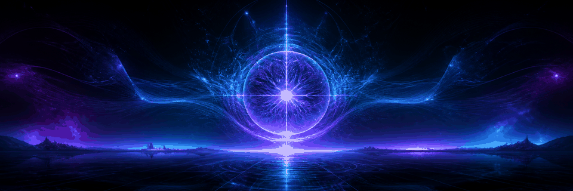

<div align="center">



# VISUAL MOTIVATION ✦

### `HUMAN × AI × IMAGINATION`

**A visual laboratory for ideas shaped through conversation with artificial intelligence.**

Generative art · Prompt exploration · Imagined worlds

</div>

---

## About

## From Prompt to Visual Conversation

### A Short History of Image Generation in ChatGPT

The story of image generation in ChatGPT did not begin with a gallery, a design application, or even ChatGPT itself. It began with a research question:

> **Could an artificial intelligence understand a written idea well enough to imagine it visually?**

In January 2021, OpenAI introduced the first **DALL·E**, a 12-billion-parameter version of GPT‑3 trained to create images from textual descriptions. Its early results were imperfect, strange, and often unpredictable, but they demonstrated something important: language and images could be connected inside a generative system. A written combination of distant ideas could become a new visual object that had never existed before.  
[OpenAI — DALL·E: Creating Images from Text](https://openai.com/index/dall-e/)

This was the beginning of a new relationship between language and visual creation.

### 2021 — The Experimental Beginning

The first DALL·E was primarily a research milestone. It could combine objects, attributes, styles, perspectives, and improbable concepts described in natural language.

What made it historically significant was not visual perfection. Its importance was the possibility it revealed: a person did not need to draw every line or manually construct every element to communicate a visual idea. Language itself could become a creative instrument.

At this stage, the interaction was still largely based on a conventional model:

`Write Prompt → Generate Image → Inspect Result`

The prompt acted as an instruction, and the generated image acted as an answer.

### 2022 — DALL·E 2 and Wider Creative Access

In 2022, **DALL·E 2** substantially improved realism, resolution, and the relationship between a written description and its visual result. It could generate original images, create variations, edit selected parts of an image through inpainting, and extend scenes beyond their original boundaries through outpainting.

OpenAI initially released it as a limited research preview and gradually expanded access. By September 2022, the waiting list had been removed, and image generation was moving from research demonstrations toward practical creative use.  
[OpenAI — DALL·E 2](https://openai.com/index/dall-e-2/) · [OpenAI — DALL·E Without a Waitlist](https://openai.com/index/dall-e-now-available-without-waitlist/)

This period established many of the practices that would define early AI image creation:

- experimenting with prompt wording;
- generating multiple alternatives;
- selecting rather than directly constructing the final image;
- accepting unexpected model interpretations;
- treating errors as part of exploration;
- combining concepts that would be difficult to stage physically.

The human role began to shift from direct image maker toward a mixture of author, director, editor, and curator.

### 2023 — DALL·E 3 Enters the Conversation

The decisive change arrived with **DALL·E 3** and its integration into ChatGPT in 2023.

DALL·E 3 improved image quality and adherence to detailed descriptions, but its integration with ChatGPT changed more than technical performance. A user no longer needed to translate every idea into a perfectly engineered prompt alone.

Instead, the concept could develop through conversation.

A person could describe a feeling, an incomplete scene, a strange association, or a narrative intention. ChatGPT could interpret that conversation, expand it into a richer visual instruction, and send it to DALL·E 3. The resulting image could then be discussed and refined in the same chat.

The workflow became:

`Conversation → Interpretation → Visual Generation → Reflection → Iteration`

In October 2023, OpenAI made this conversational DALL·E 3 experience available to ChatGPT Plus and Enterprise users.  
[OpenAI — DALL·E 3 in ChatGPT](https://openai.com/index/dall-e-3-is-now-available-in-chatgpt-plus-and-enterprise/)

This was an important creative transition. Image generation was no longer only about writing a command. It was becoming a dialogue.

### 2024 — Conversational Image Generation Reaches Free Users

On **8 August 2024**, OpenAI began rolling out DALL·E 3 image generation to users of the free ChatGPT plan. Free users could create up to two images per day.  
[OpenAI — ChatGPT Release Notes](https://help.openai.com/en/articles/6825453-chatgpt-release-notes)

Although the allowance was small, the historical importance was considerable. Conversational image generation was becoming accessible to people who had no paid subscription and might never have used a specialized generative-art platform.

The daily limit also influenced the creative process. When only two generations were available, each attempt carried more weight. Users had to decide which idea deserved to become an image, how to communicate it, and which result was worth preserving.

Works such as **TeamWin — Victory Is a Shared Moment** and **Zen on the Zastava** emerged from this period.

They were not created from formal design briefs. They developed through relaxed conversations, spontaneous cultural associations, humor, personal experience, and curiosity about what ChatGPT might imagine.

Their imperfections—malformed lettering, uncertain object relationships, inconsistent equipment, and visually plausible but logically inaccurate details—are now part of their historical value. They document both the creative possibilities and technical limitations of DALL·E 3 during an early period of Free-plan access.

### 2025 — Image Generation Becomes Native to the Conversation

In March 2025, OpenAI introduced image generation built natively into **GPT‑4o**. Rather than relying on a more visibly separated relationship between a conversational system and an image generator, visual generation became part of a natively multimodal model.

This brought stronger instruction following, improved text rendering, better use of conversational context, image transformation, and more consistent multi-turn refinement. It also moved generated imagery beyond purely decorative or surreal experimentation toward diagrams, posters, infographics, product concepts, educational material, and practical visual communication.  
[OpenAI — Introducing 4o Image Generation](https://openai.com/index/introducing-4o-image-generation/)

The creative process increasingly became:

`Discuss → Generate → Upload → Edit → Compare → Refine`

A user could bring an existing image into the conversation, request a controlled change, preserve important details, and continue developing the result without restarting the idea from the beginning.

In December 2025, OpenAI introduced a newer ChatGPT Images experience powered in the API by **GPT Image 1.5**, emphasizing faster generation and more precise edits that preserved important elements across iterations.  
[OpenAI — The New ChatGPT Images](https://openai.com/index/new-chatgpt-images-is-here/)

### 2026 — Images Become Visual Thought

In April 2026, OpenAI introduced **ChatGPT Images 2.0**, marking another shift in the role of generative imagery.

The focus expanded from creating visually convincing pictures toward producing controlled, information-rich, and practically useful visual artifacts. Improvements included stronger world knowledge, greater precision, multilingual text rendering, flexible formats, more sophisticated styles, and better handling of complex visual instructions.

A new thinking mode also connected image generation with reasoning and tools, allowing the system to research, organize, and visually communicate more complex subjects. ChatGPT Images 2.0 became available across all ChatGPT plans, while thinking-assisted image creation was introduced on selected paid plans.  
[OpenAI — Introducing ChatGPT Images 2.0](https://openai.com/index/introducing-chatgpt-images-2-0/) · [OpenAI — Images in ChatGPT](https://help.openai.com/en/articles/11084440-images-in-chatgpt)

The image generator was no longer only a machine for illustrating prompts. It was becoming a visual collaborator capable of helping explore, explain, edit, prototype, and communicate ideas.

## A Changing Human Role

Across this history, the human role has not disappeared. It has become more layered.

The creator may now act as:

- **originator**, introducing the experience, question, or emotional impulse;
- **conversational partner**, allowing an idea to develop through language;
- **visual director**, defining atmosphere, composition, color, and meaning;
- **editor**, identifying what should change and what must remain;
- **curator**, deciding which generation deserves to be preserved;
- **historian**, documenting the model, context, limitations, and moment of creation.

The model can produce pixels, but it does not independently determine why an image matters. Meaning still comes from the relationship between intention, interpretation, selection, and context.

## What the Early Images Preserve

Older AI-generated images should not always be replaced simply because newer models can produce cleaner results.

Their artifacts are evidence of their time.

A malformed license plate, an uncertain hand, an impossible sword, or unreadable lettering can reveal the limits of a particular generation of technology. When the creation period and workflow are documented honestly, these imperfections become comparable to traces left by older cameras, early digital graphics, or obsolete printing processes.

For this reason, **VisualMotivation** preserves selected images in their original form. The repository is not only a collection of finished visuals. It is also a record of how human–AI collaboration changed over time.

## Looking Toward the Future

The future of image generation cannot be documented in the same way as its past. It can only be considered as a direction.

Future systems may provide greater consistency across characters, scenes, and long-form visual narratives. They may connect still images more naturally with animation, sound, spatial environments, interactive media, and real-time collaboration. Visual creation may increasingly involve persistent projects in which an AI remembers the artistic language, recurring subjects, previous decisions, and ethical boundaries of a body of work.

Authorship may become less about executing every visual detail manually and more about establishing purpose, taste, constraints, continuity, and responsibility.

At the same time, improved realism will make provenance increasingly important. Future visual culture will need reliable ways to distinguish generation, editing, documentation, reconstruction, and photography. Preserving prompts, creation dates, model information, source material, and human decisions may become as important as preserving the final image itself.

The most meaningful future is therefore not one in which AI replaces imagination. It is one in which people gain new ways to examine, express, and communicate what they imagine.

> **The history began with text becoming an image.  
> It continued with prompts becoming conversations.  
> Its future may be conversations becoming complete visual worlds.**

## Timeline at a Glance

| Year | Milestone | Creative Shift |
|---|---|---|
| 2021 | First DALL·E introduced | Text could generate new visual concepts |
| 2022 | DALL·E 2 expanded access and editing | Image generation became a practical creative tool |
| 2023 | DALL·E 3 integrated into ChatGPT | Prompting evolved into visual conversation |
| 2024 | DALL·E 3 reached ChatGPT Free users | Conversational image creation became broadly accessible |
| 2025 | Native GPT‑4o image generation and newer ChatGPT Images | Generation and editing became more contextual and precise |
| 2026 | ChatGPT Images 2.0 | Image creation increasingly incorporated reasoning, knowledge, and professional visual communication |
| Future | Deeper continuity, multimodality, and provenance | Images may develop into persistent, interactive visual worlds |

**VisualMotivation** is an evolving portfolio of AI-assisted visual experiments.

Each piece begins with a human idea and develops through dialogue, iteration, and creative direction. AI is not treated as an automatic answer, but as a collaborative medium—one that helps explore composition, atmosphere, color, form, and unexpected possibilities.

The result is a curated record of both the final visuals and the thinking that shaped them.

## Visual Worlds

| | Theme | Direction |
|:--:|---|---|
| ◈ | **Cyberpunk** | Neon cities, digital identities, and high-tech futures |
| ⟡ | **Retro Futurism** | Yesterday's visions of tomorrow, reimagined |
| ✦ | **Sci-Fi** | Distant worlds, speculative technology, and cosmic narratives |
| ◇ | **Minimalism** | Essential forms, quiet compositions, and visual clarity |
| ⌁ | **Abstract** | Color, texture, motion, and open interpretation |
| 🧪 | **Experiments** | Unconventional prompts, new techniques, and creative detours |
### 🧪 Featured Experiment

[**TeamWin — Victory Is a Shared Moment**](experiments/teamwin-happy/)
[**ZastavaZen**](experiments/zastavazen/)

A techno-optimistic exploration of teamwork, human connection, and the natural joy that follows a shared achievement.

## Creative Process

```text
Concept  →  Iteration  →  Visual Direction  →  Final Result
```

**Concept**  
Define the central idea, emotion, story, or question.

**Iteration**  
Explore prompt variations, compositions, moods, and alternatives.

**Visual Direction**  
Refine the strongest path through deliberate choices in style, light, color, and detail.

**Final Result**  
Select and present the visual that best expresses the original intent—or transforms it into something unexpected.

## Project Philosophy

> The most interesting AI-generated image is not the first result.  
> It is the result of curiosity, selection, refinement, and human intent.

This repository documents that journey: a meeting point between imagination and machine-assisted creation.

---

<div align="center">

### `CREATE · QUESTION · ITERATE · DISCOVER`

*VisualMotivation is an ongoing exploration. New worlds will appear as the conversation continues.*

</div>
